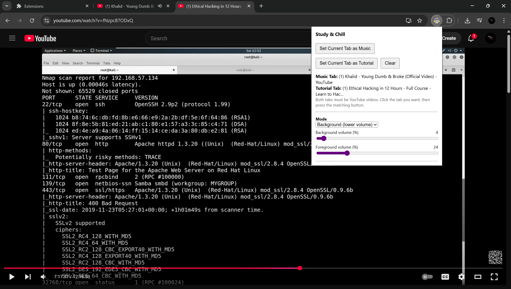

# Study & Chill – YouTube Music & Tutorial Focus Extension

**Study & Chill** is a Chrome extension designed to help you focus while studying or watching tutorials on YouTube. It allows you to automatically control your music playback while you watch a tutorial  either by pausing it or lowering its volume so you don’t have to keep switching tabs manually.

## 📝 Why I Created This

When I study programming, pen testing or follow a tutorial, I often listen to background music. But it was frustrating to constantly switch between tabs to:

- Pause or lower the music when I need to focus on the tutorial.  
- Restore or increase the music volume after practicing or pausing the tutorial.  

To save time and reduce distractions, I created **Study & Chill**. With this extension, you only need to:

1. Set your **Music tab**.  
2. Set your **Tutorial tab**.  
3. Choose how the music behaves when the tutorial plays:  
   - **Stop**: pause the music completely.  
   - **Background**: lower the music volume to a custom level.  

When you pause or stop the tutorial, the music automatically resumes or returns to the volume you specify. No more back-and-forth just focus on what you're studying!

## 🎯 Features

- Set Music & Tutorial tabs easily with one click.  
- Stop or lower music volume automatically when the tutorial plays.  
- Restore music volume or resume playback when the tutorial pauses.  
- Customizable background and foreground volume sliders in Background mode.  
- Lightweight and easy to use.  
- Works only for YouTube videos (music or tutorial).  

## ⚙️ How to Use (Developer Mode)

Since this extension is not published in the Chrome Web Store, you can use it locally:

1. Download or clone the extension.  
2. Open Chrome and go to `chrome://extensions`.  
3. Enable **Developer mode** (top right).  
4. Click **Load unpacked** and select the extension folder.  
5. Open your Music YouTube tab and click the extension icon → “Set Current Tab as Music.”  
6. Open your Tutorial YouTube tab and click the extension icon → “Set Current Tab as Tutorial.”  
7. Choose the mode (Stop or Background) and adjust volume sliders if using Background mode.  
8. Play the tutorial the music tab will automatically pause or adjust volume based on your settings.  

## 💡 Tips

- Make sure your music tab has user interaction (click once) so Chrome allows volume control/playback.  
- You can adjust **Background volume** (music when tutorial plays) and **Foreground volume** (music when tutorial pauses).  
- You can clear tabs anytime from the popup to reset or choose new tabs.  

## 🚀 Contribute

Feel free to fork or clone the repository and add any functionality you want!  

Some ideas:  
- Auto-detect YouTube tutorial or music tabs by title or URL.  
- Support multiple music tabs.  
- Add a hotkey to toggle between modes.  

Happy to see what you add to this extension!

## 🙏 Why This Helps

This extension saved me a lot of time and helped me focus more on studying or following tutorials. Hopefully, it can do the same for you!